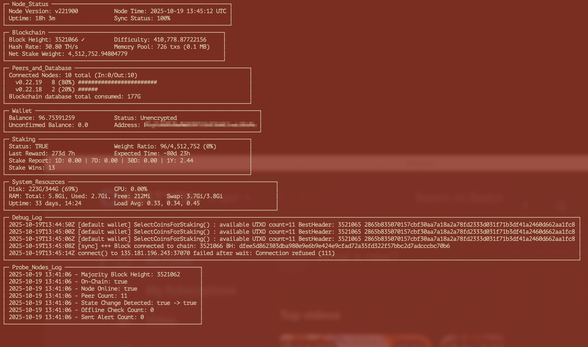
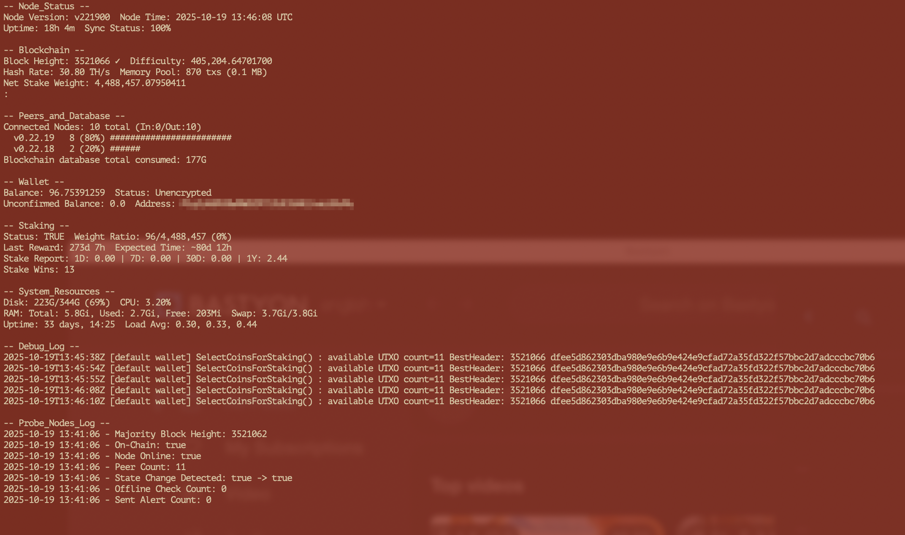

# Pocketnet Watch

A real-time monitoring dashboard for Pocketnet nodes with a beautiful, flicker-free terminal interface.


## Overview

Pocketnet Watch is a comprehensive monitoring tool for Pocketnet node operators. Built with Python and the curses library, it provides a smooth, professional terminal UI similar to `htop` or `vim` - no more flickering screens!

## Key Features

- **🎨 Flicker-free display** - Smooth, professional curses-based UI
- **📊 Real-time metrics** - Node status, blockchain, staking, wallet, and system resources
- **⚠️ Fork detection** - Visual alerts when chain health issues detected
- **📈 Peer visualization** - Histogram showing connected node version distribution
- **⚙️ Flexible modes** - Choose between boxed or compact display
- **🔄 Configurable refresh** - Adjust update intervals to your needs
- 🔧 Config file support - Persistent settings without command-line flags
- 🧪 Connection testing - Built-in connection test mode for debugging

## Quick Start

```bash
# Clone the repository
git clone https://github.com/Pewejekubam/pocketnet_watch.git
cd pocketnet_watch

# Make executable
chmod +x watch.py

# Run with default settings
./watch.py

# Run in compact mode
./watch.py -c

# Custom refresh interval
./watch.py -r 10

# Test connection to pocketcoin-cli
./watch.py --test-connection
```

Press `Ctrl+C` to exit.

## Configuration
Pocketnet Watch now supports a configuration file for persistent settings. On first run, if no config file exists, it creates one from the provided example template.

**Configuration file location**: `pocketnet_watch_config.ini` in the same directory as the script.

**Configuration sections**:
```ini
[pocketcoin]
# Command-line arguments passed to pocketcoin-cli (e.g., "-rpcport=38081 -conf=/path/to/pocketcoin.conf")
# Leave empty for default configuration
cli_args =

# Data directory path (default: ~/.pocketcoin)
data_dir = ~/.pocketcoin

[ui]
# Refresh interval in seconds (default: 5)
refresh_seconds = 5

# UI display mode - true for boxed UI with borders, false for compact mode (default: true)
use_boxed_ui = true

[logs]
# Path to probe nodes log file (default: ~/probe_nodes/probe_nodes.log)
probe_nodes_log = ~/probe_nodes/probe_nodes.log
```
# Create config from example (done automatically on first run if missing)
cp pocketnet_watch_config.ini.example pocketnet_watch_config.ini
# Then edit the config file to your preferences
vi pocketnet_watch_config.ini

## Screenshots

### Boxed Mode (Default)


### Compact Mode


## Requirements

- **Python 3.10+** (included in both Ubuntu 22.04+ and Debian 12+)
- **pocketcoin-cli** in your PATH
- Standard utilities: `jq`, `bc`, `du`, `df`, `free`, `top`

## Command-Line Options

```
./watch.py [options]

Options:
  -h, --help              Show help message and exit
  -c, --compact           Use compact UI without borders
  -b, --boxed             Use boxed UI with borders (default)
  -r, --refresh SECONDS   Set refresh interval (default: 5 seconds)
  -t, --test-connection   Test the connection to the pocketcoind and exit
```
## Connection Testing
If you're having issues connecting to pocketcoin-cli, use the --test-connection flag:
``
./watch.py --test-connection
``

This will:
- Load your configuration file
- Test the pocketcoin-cli connection with the configured arguments
- Show detailed output about the connection attempt and any errors encountered

## What's Monitored

### Node Status
- Node version
- Uptime
- Sync status
- UTC time

### Blockchain
- Block height with fork indicator (✓/⚠)
- Network difficulty
- Hash rate
- Memory pool status
- Net stake weight
- Fork alerts (when >3 recent competing chains)

### Connected Nodes
- Total peer count (In/Out breakdown)
- Top 3 peer versions with visual histogram
- Real-time connection monitoring

### Peers & Database
- Total blockchain database size
- Combined metrics from blocks, chainstate, indexes, and pocketdb

### Wallet
- Balance (formatted with commas)
- Wallet status (Locked/Unlocked/Unencrypted)
- Unconfirmed balance
- Highest balance address

### Staking
- Staking status (TRUE/FALSE)
- Weight ratio and percentage
- Time since last reward
- Expected time to next reward
- Stake report (1D, 7D, 30D, 1Y)
- Total stake wins

### System Resources
- Disk usage
- CPU usage
- RAM usage (total/used/free)
- Swap memory
- System uptime
- Load averages

## Display Modes

### Boxed Mode (Default)
Beautiful bordered sections with clear visual separation:
```
┌─ Node_Status ──────────────────────────────────────┐
│ Node Version: v221900  Node Time: 2025-10-19 UTC   │
│ Uptime: 10d 18h        Sync Status: 100%           │
└────────────────────────────────────────────────────┘
```

### Compact Mode (`-c`)
Space-efficient display without borders:
```
-- Node_Status --
Node Version: v221900
Node Time: 2025-10-19 UTC
Uptime: 10d 18h
Sync Status: 100%
```

## Version History
### v2.1.0 (2026-07-10) - Configuration introduction
- New: Configuration file support (pocketnet_watch_config.ini)
- New: Configurable paths for data directory and log files
- New: Connection test mode (--test-connection)
- New: Improved CLI integration via _run_cli method

### v2.0.0 (2025-10-19) - Major Architecture Shift
- **Complete rewrite in Python** with curses library
- Flicker-free rendering with double-buffering
- Hidden cursor during updates
- Terminal color scheme adaptation
- Fork detection with visual indicators
- Multi-line peer version histogram
- Improved time formatting
- Enhanced error handling
- All Bash v0.6.0 features preserved

### v0.6.0 (2025-10-18) - Bash Refactor
- JSON-driven UI configuration
- Modular metric functions
- Improved code organization

### Legacy Versions (v0.0 - v0.5.0)
See `legacy/` directory for historical versions.

## Documentation

For detailed documentation including:
- Advanced configuration
- JSON layout customization
- Extending with custom metrics
- Troubleshooting guide
- Architecture details

See **[DOCUMENTATION.md](docs/DOCUMENTATION.md)**

## Contributing

Contributions are welcome! Please feel free to:
- Submit pull requests
- Open issues for bugs or feature requests
- Improve documentation
- Share feedback

## License

MIT License - See [LICENSE](LICENSE) file for details.

## Acknowledgments

- Built for the **Pocketnet community**
- Powered by **Claude Sonnet 4.5**
- Thanks to all contributors and testers

---

**Need help?** Open an issue or check the [full documentation](docs/DOCUMENTATION.md).
